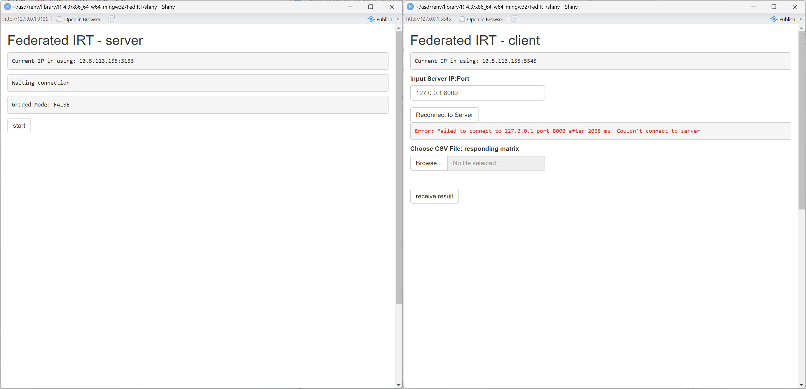

# FedIRT
``FedIRT`` is an ``R`` package that enables federated estimation of Item Response Theory (IRT) models, including 1PL, 2PL, and Generalized Partial Credit Models (GPCM). By integrating federated learning, this package allows decentralized data analysis without compromising data privacy. Unlike traditional IRT packages that require centralized data storage (e.g., mirt, ltm), FedIRT ensures that raw response data remains on local devices while still achieving accurate parameter estimation.

# Availability

## Installation

You can install `FedIRT` from [CRAN](https://cran.r-project.org/package=FedIRT) (stable release) or [Github](https://github.com/Feng-Ji-Lab/FedIRT) (latest development version):

### Github
``` r
devtools::install_github("Feng-Ji-Lab/FedIRT")
library(FedIRT)
```

### CRAN
``` r
install.packages("FedIRT")
library(FedIRT)
```


## Example of the Shiny App

To provide wider access for practitioners, we include the Shiny user interface in our package. A detailed manual was provided in the package. Taking the 2PL as an example, we illustrate how to use the Shiny app below.

In the first step, the server end (e.g., test administer, school board) can be launched by running the Shiny app `runserver()` and the client-end Shiny app can be initialized with `runclient()` with the interface shown below:



When the client first launches, it will automatically connect to the localhost port `8000` as default. 

If the server is deployed on another computer, type the server's IP address and port (which will be displayed on the server's interface), then click "reconnect". The screenshots of the user interface are shown below. 


Then, the client should choose a file to upload to the local Shiny app to do local calculations, without sending it to the server. The file should be a `csv` file, with either binary or graded response, and all clients should share the same number of items, and the same maximum score in each item (if the answers are polytomous), otherwise, there will be an error message suggesting to check the datasets of all clients.


After all the clients upload their data, the server should click "start" to begin the federated estimates process and after the model converges, the client should click "receive result". The server will display all item parameters and the client will display all item parameters and individual ability estimates. 


The clients will also display bar plots of the ability estimates. 


## Example of the integrated function

We provide a function `fedirt_file()` in the package, and the detailed usage of the function is shown in the user manual. We demonstrate an example here. 

Suppose we have a dataset called `dataset.csv`, and the head of this dataset is shown below. There should be one column indicating the school, for example, "site" here. Each other column indicates an item, and each row represents an answering status. 

| site | X1 | X2 | X3 | X4 | X5 |
|------|----|----|----|----|----|
| 10   | 1  | 0  | 0  | 0  | 0  |
| 7    | 0  | 0  | 1  | 0  | 0  |
| 9    | 0  | 0  | 1  | 1  | 1  |
| 1    | 1  | 0  | 1  | 1  | 1  |
| 2    | 1  | 0  | 0  | 0  | 0  |

First, we need to read the dataset.

``` r
# read dataset
data <- read.csv("dataset.csv", header = TRUE)
```

Then, we call the function `FedIRT::fedirt_file()` to get the result. It returns a list of item discriminations, item difficulties, and each sites' effect and each students' abilities. 

``` r
# call the fedirt_file function 
result <- fedirt_file(data, model_name = "2PL")
```

At last, extract the results or use the parameters for further analysis. 

``` r
result$a
result$b
```

Apart from using the results for further analysis, we can also use `summary()` to generate a snapshot of the result. Here is an example below. 

``` r
summary(result)
```

Then, the result will be printed in the console as follows:

```
Summary of FedIRT Results:


Counts:
function gradient 
     735      249 

Convergence Status (convergence):
Converged

Log Likelihood (loglik):
[1] -7068.258

Difficulty Parameters (b):
 [1] -185.88151839    0.99524035    0.92927254   46.91467856   -2.35233826    1.14345597    2.85965632    1.10711090
 [9]  233.71220828    1.38347871   -0.23225470    0.06609564   21.05618331  304.09705885 -526.66657205   -0.14986037
[17]  125.24887707   -1.84127231    1.77578683 -619.34744167    0.20255058    2.29410199    0.60079974   74.31304214
[25]    0.51858750    1.92898090    1.41023060    0.78990661  244.19315984  267.20494127

Discrimination Parameters (a):
 [1]  0.0028497700  0.8440140746 -0.1190176844 -0.0004562083  0.1036843958  0.4697023939  0.7101942457 -0.3078497327
 [9]  0.0028330700  0.8728839006  1.2400233647  0.6696648247 -0.0017366710  0.0036961440  0.0032205035  0.4867575811
[17]  0.0044047947  0.8489395113  3.1232339993  0.0020422999  2.5597505359  0.8018997294  0.7124263791  0.0033861896
[25] -0.6109335099  0.9633582320  0.9364984207  0.5492777654 -0.0007372862  0.0029002538

Ability Estimates:
School 1:
 [1] -1.127097195 -0.922572829 -0.993953038  0.745126617 -0.868615677 -0.004496743 -1.335763756  0.332411623 -0.142946965
[10]  0.629199961  0.996064766  0.309137271 -0.491584992  0.811880515  0.637819122  0.807362215 -0.282205981 -0.151977508
[19]  1.489247834  0.106648066  0.070863058 -0.416262895 -0.551055060  1.089358870  0.994025477  0.114350612  0.355500117
[28]  2.181192348 -0.981141292  1.997921738  0.574057494 -1.273791145  0.083981386 -1.081395968  0.577419301 -1.200115434
[37] -0.166930167 -0.565659142  1.627428221 -1.222954662  1.502485975 -0.602600794  0.285920178 -1.269207201 -0.294879662
[46]  0.185131361  0.774232875  0.639405432  0.240086421 -0.806747734  0.707963753
School 2:
 [1] -1.41454573  1.78068772  1.87469389 -0.69393008 -0.64043522  1.00878902 -1.43625257  0.07875106 -0.48109615 -1.74497145
[11] -0.13588161  0.32713940  0.94361431 -1.10251295 -0.22403442 -1.66690636 -1.20809314 -0.06835826  0.07914619  0.95114421
[21]  0.56027437 -0.93870651  1.25793922  1.23499573  0.49142582  0.95265981 -0.41232544 -1.10838230  0.69450509  0.35078204
[31] -0.86098959  0.94962010 -0.90753669  0.71935052 -1.07196001  0.35589643
...

End of Summary
```

## Example of the personscore function

We provide a function `personscore` in the package. The detailed usage of the function is shown in the user manual. We demonstrate an example here.

``` R
personscoreResult = personscore(result)
summary(personscoreResult)
```

Summary of the person score is shown below.

```
Summary of FedIRT Person Score Results:

Ability Estimates:
School 1:
 [1] -1.127097195 -0.922572829 -0.993953038  0.745126617 -0.868615677 -0.004496743 -1.335763756  0.332411623 -0.142946965
[10]  0.629199961  0.996064766  0.309137271 -0.491584992  0.811880515  0.637819122  0.807362215 -0.282205981 -0.151977508
[19]  1.489247834  0.106648066  0.070863058 -0.416262895 -0.551055060  1.089358870  0.994025477  0.114350612  0.355500117
[28]  2.181192348 -0.981141292  1.997921738  0.574057494 -1.273791145  0.083981386 -1.081395968  0.577419301 -1.200115434
[37] -0.166930167 -0.565659142  1.627428221 -1.222954662  1.502485975 -0.602600794  0.285920178 -1.269207201 -0.294879662
[46]  0.185131361  0.774232875  0.639405432  0.240086421 -0.806747734  0.707963753
School 2:
 [1] -1.41454573  1.78068772  1.87469389 -0.69393008 -0.64043522  1.00878902 -1.43625257  0.07875106 -0.48109615 -1.74497145
[11] -0.13588161  0.32713940  0.94361431 -1.10251295 -0.22403442 -1.66690636 -1.20809314 -0.06835826  0.07914619  0.95114421
[21]  0.56027437 -0.93870651  1.25793922  1.23499573  0.49142582  0.95265981 -0.41232544 -1.10838230  0.69450509  0.35078204
[31] -0.86098959  0.94962010 -0.90753669  0.71935052 -1.07196001  0.35589643
...

End of Summary
```

## Example of the personfit function

We provide a function `personfit` in the package. The detailed usage of the function is shown in the user manual. We demonstrate an example here.

``` R
personfitResult = personfit(result)
summary(personfitResult)
```

After getting the result, use `personfit` function to get the person score result from `result` by `personfit(result)`.

```
Summary of FedIRT Person Fit Results:

Fit Estimates:
School 1:
               Lz           Zh       Infit    Outfit
4    0.7584470759  0.923163304 0.002323484 0.1482672
16  -0.7562447025 -1.131668935 0.005457117 0.1799583
27   0.3417488360  0.357870094 0.005966933 0.1734402
33  -0.9244005411 -1.359789298 0.179834037 0.2266634
...
School 2:
             Lz           Zh        Infit    Outfit
5   -0.90114567 -1.175767350 0.0009824580 0.1535794
8   -1.47957351 -1.888763364 0.1491518127 0.2255230
18  -0.13292541 -0.228824721 0.1104556086 0.2007658
19  -0.17257549 -0.277699184 0.0075031313 0.1350857
...
```

## Standard error (SE) calculation

We follow a typical process of calculating SE in MLE. After obtaining the MLE estimates, the Hessian matrix, which is the matrix of second-order partial derivatives of the log-likelihood function with respect to the parameters, is computed at the estimated parameters. The SEs are then derived from the square roots of the diagonal elements of the inverse Hessian matrix.

In our package, call the `SE()` function and input a `fedirt` object to display standard errors of item parameters. 

``` r
SE(result)
```

Below is the result of SE.

```
$a
 [1] 0.0041815497 0.1638884452 0.1204696925 ...
$b
 [1] 272.43863961   0.20737386   1.25896302 ...
```

# Community Guidelines

We welcome contributions and feedback! 

## Contributing
To contribute, fork the repository, create a new branch, make your changes, and submit a pull request. Ensure your code is well-documented and passes all checks.

## Reporting Issues
Found a bug or have a feature request? Open an issue on our [GitHub Issues page](https://github.com/Feng-Ji-Lab/FedIRT/issues) with a clear description and steps to reproduce.

## Seeking Support
Check the documentation, search existing issues, or post a question on GitHub. For urgent matters, contact ``f.ji@utoronto.ca``.

Thank you for helping improve `FedIRT`!
