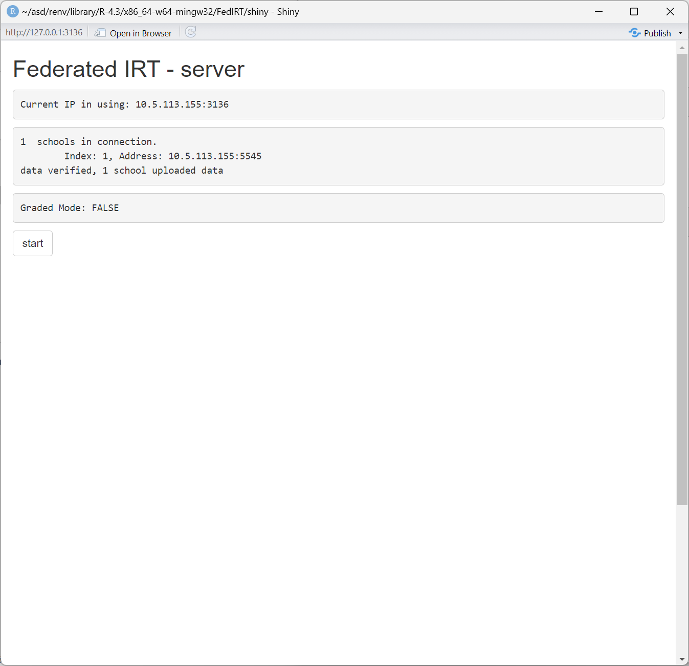
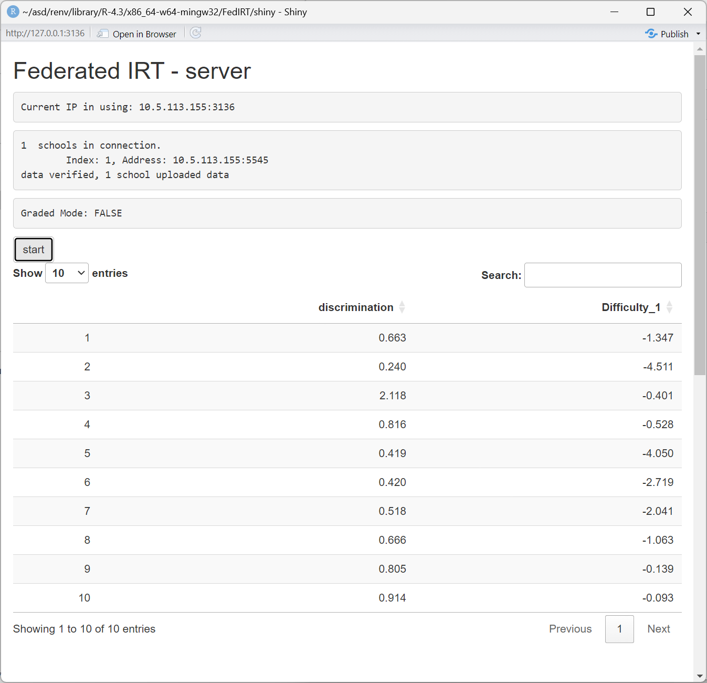

# Availability

The R package ``FedIRT`` is publicly available on [Github](https://github.com/Feng-Ji-Lab/FedIRT). It could be installed and run by using the following commands:

``` r
devtools::install_github("Feng-Ji-Lab/FedIRT")
library(FedIRT)
```

## Sample of the integrated function

We provide a function `fedirt` in the package, and the detailed usage of the function is shown in the user manual. We demonstrate a sample here. 

Suppose we have a dataset called `dataset.csv`, and the head of this dataset is shown below: 

| site | X1 | X2 | X3 | X4 | X5 |
|------|----|----|----|----|----|
| 10   | 1  | 0  | 0  | 0  | 0  |
| 7    | 0  | 0  | 1  | 0  | 0  |
| 9    | 0  | 0  | 1  | 1  | 1  |
| 1    | 1  | 0  | 1  | 1  | 1  |
| 2    | 1  | 0  | 0  | 0  | 0  |

First, we need to split the dataset by different sites. The index of each site is indicated in the column `site`. 

``` r
# split the dataset by sites
data <- read.csv("dataset.csv", header = TRUE)
data_list <- split(data[, -1], data$site)
```

Then, we change every sites' data into a list of matrices in `R`. 

``` r
# change the list into matrices
inputdata <- lapply(data_list, as.matrix)
```

Then, we call the function `FedIRT::fedirt()` to get the result. It returns a list of item discriminations, item difficulties, and each sites' effect and each students' abilities. Call `summary()` to see the returned list. 

``` r
# call the fedirt function 
result <- fedirt(inputdata, model_name = "2PL")
```

At last, print the results or use the parameters for further analysis. 

``` r
print(result$a)
print(result$b)
```

Apart from using the results for further analysis, we can also use `summary()` to generate a snapshot of the result. Here is a sample below. 

``` r
summary(result)
```

Then, the result will be printed in the console as follows:

```
Summary of FedIRT Results:


Counts:
function gradient 
     150       68 

Convergence Status (convergence):
Converged

Log Likelihood (loglik):
[1] -957.1493

Difficulty Parameters (b):
 [1]  0.1699265 -2.8088090  1.1167600  0.9893799 -2.5409030 -1.1789985 -0.5258475  0.4560620  1.3792979
[10]  1.4247369

Discrimination Parameters (a):
 [1] 0.6627037 0.2495989 2.1162137 0.8155786 0.4177167 0.4228183 0.5176585 0.6663483 0.8053621 0.9137402

School effect:
[1] 1.517844

Ability Estimates:
School 1:
  [1] -1.187698446 -0.552434825 -0.899668043 -0.206272962  0.387992333  0.678869288 -0.146111320
  [8]  0.318665280  0.408994368 -0.139117072  0.496885125  0.562515435  0.392422237  0.519555447
```

In summary, we read a dataset and split it into different sites. Note that the dataset should indicate different sites. Then call the function `fedirt` with corresponding arguments. At last, print the results in need or use the part of results needed. 

## Sample of the personscore function

We provide a function `personscore` in the package. The detailed usage of the function is shown in the user manual. We demonstrate a sample here.

``` R
personscoreResult = personscore(result)
summary(personscoreResult)
```

We called the function `FedIRT::fedirt()` to get the `result`. Then use `personscore` function to get the person score result from `result` by `personscore(result)`

```
Summary of FedIRT Person Score Results:

Ability Estimates:
School 1:
  [1] -1.184622030 -0.549302071 -0.902091156 -0.206457442  0.386666115  0.679138950
  [7] -0.147088887  0.318980882  0.411915776 -0.140957745  0.496036332  0.562691489
```

## Sample of the personfit function

We provide a function `personfit` in the package. The detailed usage of the function is shown in the user manual. We demonstrate a sample here.

``` R
personfitResult = personfit(result)
summary(personfitResult)
```

We called the function `FedIRT::fedirt()` to get the `result`. Then use `personfit` function to get the person score result from `result` by `personfit(result)`

```
Summary of FedIRT Person Fit Results:

Fit Estimates:
School 1:
                 Lz            Zh      Infit     Outfit
  [1,] -0.925209243 -1.6737819927 0.23991579 0.24675914
  [2,] -0.443958144 -0.7745951619 0.29205337 0.29671611
```

## Sample of the Shiny App

To provide wider access for practitioners, we include the Shiny user interface in our package. A detailed manual was provided in the package. Taking the 2PL as an example, we illustrate how to use the Shiny app below.

In the first step, the server end (e.g., test administer, school board) can be launched by running the Shiny app (`runserver()`) with the interface shown below:


Then, the client-end Shiny app can be initialized (`runclient()`). 

When the client first launches, it will automatically connect to the localhost port `8000` as default. 

If the server is deployed on another computer, type the server's IP address and port (which will be displayed on the server's interface), then click "reconnect". The screenshots of the user interface are shown below. 


Then, the client should choose a file to upload to the local Shiny app to do local calculations, without sending it to the server. The file should be a `csv` file, with either binary or graded response, and all clients should share the same number of items, and the same maximum score in each item (if the answers are polytomous), otherwise, there will be an error message suggesting to check the datasets of all clients.




After all the clients upload their data, the server should click "start" to begin the federated estimates process and after the model converges, the client should click "receive result". The server will display all item parameters and the client will display all item parameters and individual ability estimates. 




The clients will also display bar plots of the ability estimates. 


