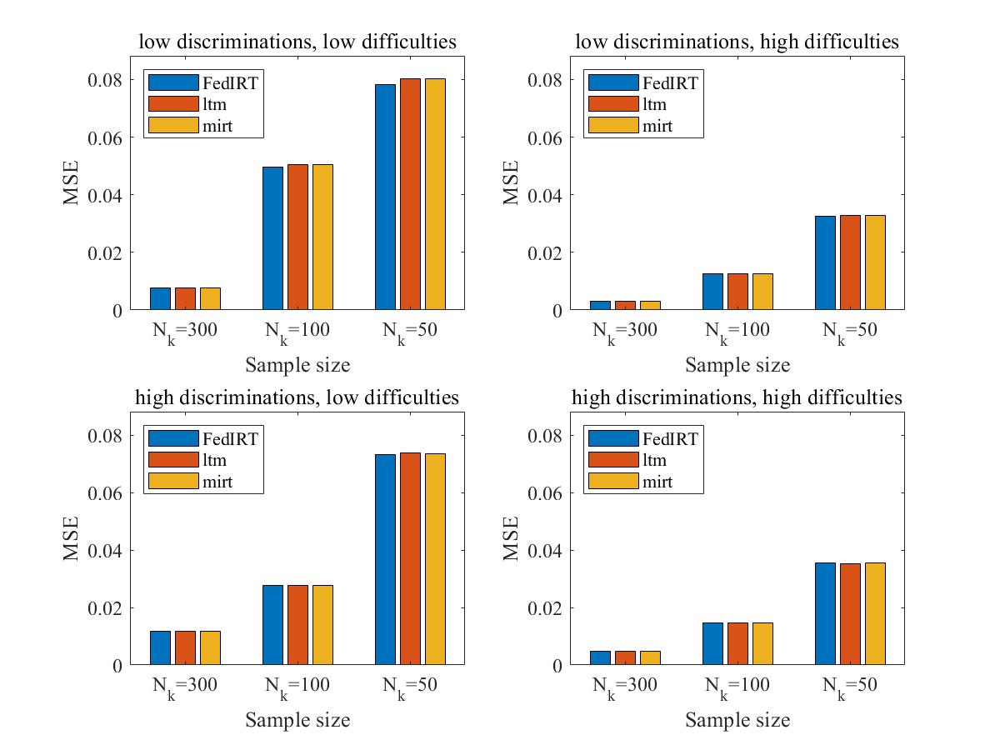
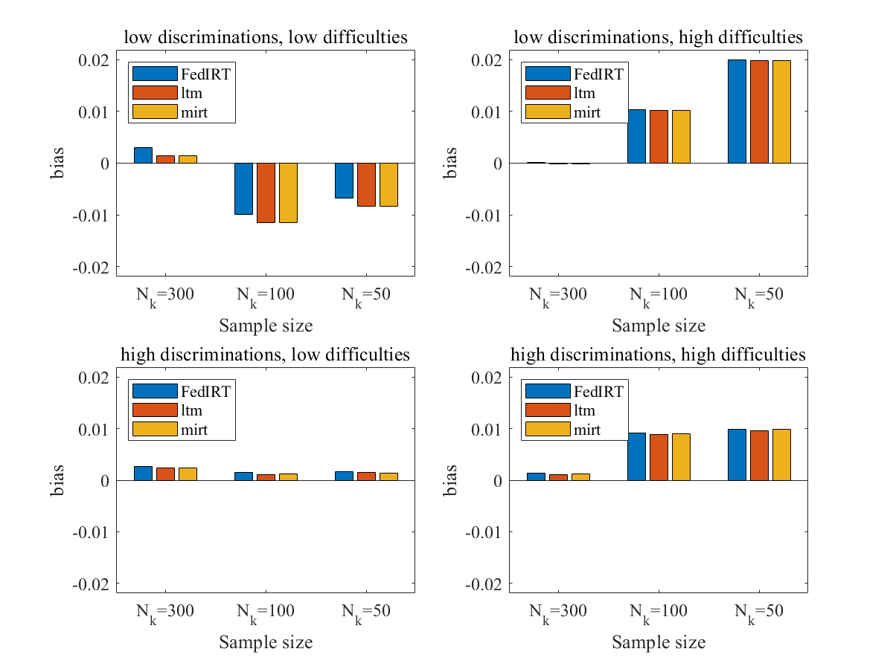

---
title: '``FedIRT``: An R package with shiny app for Estimating Federated Response Model'
authors:
- name: Biying Zhou
  orcid: 0000-0002-3590-3408
  affiliation: 1
- name: Feng Ji
  orcid: 0000-0002-2051-5453
  affiliation: 1
affiliations:
- name: Department of Applied Psychology & Human Development, University of Toronto, Toronto, Canada
  index: 1
date: "\\today"
output: pdf_document
bibliography: paper.bib
tags:
- R
- shiny app
- Federated Learning
- Item Response Theory
- Maximum Likelihood Estimation
<!-- header-includes:
  \usepackage{bm} -->
---

# Summary

We developed an `R` pckage `FedIRT`, to enable estimating traditional IRT models with additional privacy, allowing estimation in a distributed manner without losing estimation accuracy. Numerical experiments demonstrate that Federated IRT estimation achieves comparable statistical performance compared to normal IRT, with the benefits of privacy preservation and minimal communication costs. Our shiny app built in this package allows schools and educational centers use our algorithm in a distributed approach. 

# Statement of Need

Traditional IRT estimation requires all individual raw response data to be centralized in one place, thus potentially causing privacy issues. We developed an `R` pckage `FedIRT` to address this problem, which could estimate IRT model in a distributed way, without centering the dataset in schools. 

Our package include a function `fedirt` and a shiny app, including a `server.R` and a `client.R`, which could be used as the educational center and distributed schools. 

# Method

We use Maximum Likelihood Estimation (MLE) to estimate IRT model. 

In `server.R`, we implement the functions to update the model parameters, and in `client.R`, we implement the functions to calculate the likelihood values. Thus, by iterations, we could estimate the model parameters. 

# Comparison with existing packages

We compared our algorithm performance with two existing packages: `ltm` [@rizopoulos2007ltm] and `mirt` [@chalmers2012mirt], which are used to estimate classical IRT models. Simulation results show that our package perform as efficient and accurate as these two packages. 

We use the following formula to calculate the MSE. 

$$ \widehat{MSE} = \frac{ \sum\limits_{t=1}^{T} \sum\limits_{j=1}^J (( \hat{\alpha}_{jt} - \alpha_{j} )^2 + (\hat{\beta}_{jt} - \beta_{j} )^2) }{2JT} $$

The figure below shows the MSE comparison. 



We also show the bias in the following figure, showing that our package has low bias. 

$$ \widehat{bias} = \frac{ \sum\limits_{t=1}^{T} \sum \limits_{j=1}^{J} ( ( \hat{\alpha}_{jt} - \alpha_{j} ) + (\hat{\beta}_{jt} - \beta_{j} )  ) }{2JT} $$



# Availability

The R package ``FedIRT`` is publicly available on [Github](https://github.com/zby0327/fedirt). It could be installed and run by using the following commands:

``` r
devtools::install_github("zby0327/fedirt")
library(fedirt)
```

# Acknowledgements


# References


