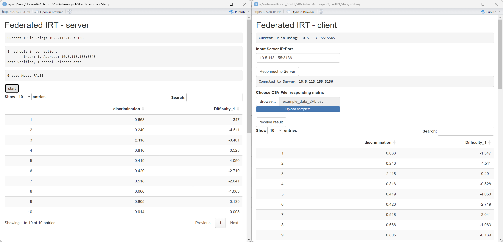

---
title: '``FedIRT``: An R package and shiny app for estimating federated item response theory models'
authors:
- name: Biying Zhou
  orcid: 0000-0002-3590-3408
  affiliation: 1
- name: Feng Ji
  orcid: 0000-0002-2051-5453
  affiliation: 1
  corresponding: true
  email: f.ji@utoronto.ca
affiliations:
- name: Department of Applied Psychology & Human Development, University of Toronto, Toronto, Canada
  index: 1
date: "\\today"
output: pdf_document
bibliography: paper.bib
tags:
- R
- shiny app
- Federated Learning
- Item Response Theory
- Maximum Likelihood Estimation
<!-- header-includes:
  \usepackage{bm} -->
---

# Summary

Educational and psychological testing data are often sensitive, making centralized analysis challenging due to privacy concerns. To address this, we developed `FedIRT`, an `R` package that estimates Item Response Theory (IRT) models—including 1PL, 2PL, and graded response models, using federated learning. This approach enables multiple institutions (e.g., schools, districts) to collaboratively estimate model parameters without sharing raw data. `FedIRT` ensures privacy preservation while maintaining estimation accuracy comparable to mainstream IRT packages. Additionally, the package includes a user-friendly Shiny app, making federated IRT analysis accessible to researchers and practitioners without requiring advanced programming skills.

# Statement of Need

IRT [@embretson2013item] is widely used in educational, social, and behavioral sciences to assess abilities, attitudes, and other latent traits from test or survey responses. For example, IRT is used in standardized testing (e.g., SAT, GRE) to measure student proficiency, in psychological assessments to evaluate mental health indicators, and in large-scale surveys to estimate public opinion trends.

However, traditional IRT estimation requires all individual response data to be collected and processed in a centralized location. This poses significant privacy concerns, particularly when handling sensitive data from schools, educational institutions, and research studies [@lemons2014predictive]. Many school districts and organizations have strict data-sharing policies that prevent researchers from accessing raw student response data, limiting their ability to conduct large-scale educational assessments.

Federated learning offers a promising solution by enabling parameter estimation in a decentralized manner, ensuring privacy while still allowing researchers to analyze large-scale assessment data. Despite its potential, no existing R package in psychometrics supports federated learning for IRT estimation. Popular packages such as `mirt` [@chalmers2012mirt] and `ltm` [@rizopoulos2007ltm] require centralized data storage, making them unsuitable for privacy-sensitive applications.

To address this gap, we developed `FedIRT`, the first open-source R package that integrates federated learning with IRT estimation in a fully distributed manner. Unlike most theoretical research on federated learning, which often lacks practical implementations, `FedIRT` provides a working solution that enables multiple institutions (e.g., school districts, research organizations) to collaboratively estimate IRT parameters without sharing raw data. The package also includes a user-friendly Shiny app, making it accessible to education researchers, social scientists, and policymakers who may not have extensive programming experience. By bridging the gap between federated learning research and real-world applications, `FedIRT` provides a practical tool for privacy-preserving IRT analysis.

We estimate IRT models using federated stochastic gradient descent (FedSGD) and federated averaging (FedAvg). This enables decentralized model estimation without sharing raw data, ensuring privacy while maintaining accuracy. For technical details, refer to our methodological discussions on Federated IRT [@FedIRT2023; @FederatedIRT2024_1; @FedIRT2024]. We support 1PL, 2PL, and graded models.

# Comparison with existing packages

We demonstrate that our package generates comparable results to established IRT packages, such as mirt [@chalmers2012mirt].

\autoref{acomparison} and \autoref{bcomparison} show the comparison of the discrimination and difficulty parameters between `mirt` and `FedIRT` based on `example_data_2PL` in our package.


# Availability

The R package ``FedIRT`` is publicly available on [CRAN](https://cran.r-project.org/package=FedIRT) (stable release) and [Github](https://github.com/Feng-Ji-Lab/FedIRT) (latest development version):

## Github
``` r
devtools::install_github("Feng-Ji-Lab/FedIRT")
library(FedIRT)
```

## CRAN
``` r
install.packages("FedIRT")
library(FedIRT)
```

## Example of the Shiny App

To provide wider access for practitioners in real-world applications, we include the Shiny user interface in our package. A detailed manual was provided in the package. Taking the 2PL as an example, we illustrate how to use the Shiny app below.

In the first step, the server end (e.g., test administer, school board) can be launched by running the Shiny app `runserver()` and the client-end Shiny app can be initialized with `runclient()` with the interface shown below:


When the client first launches, it will automatically connect to the localhost port `8000` by default. 

If the server is deployed on another computer, type the server's IP address and port (which will be displayed on the server's interface), then click "Reconnect". The screenshots of the user interface are shown below.


Then, the client should choose a file to upload to the local Shiny app to perform local calculations, without sending it to the server. The file should be a `CSV` file with either binary or graded responses. All clients should share the same number of items and the same maximum score for each item (if the responses are polytomous); otherwise, an error message will suggest checking the datasets of all clients.


After all the clients upload their data, the server should click "Start" to begin the federated estimation process. After the model converges, the clients should click "Receive Result". The server will display all item parameters, and the clients will display all item parameters and individual ability estimates.




The clients will also display bar plots of the ability estimates. 


# References
