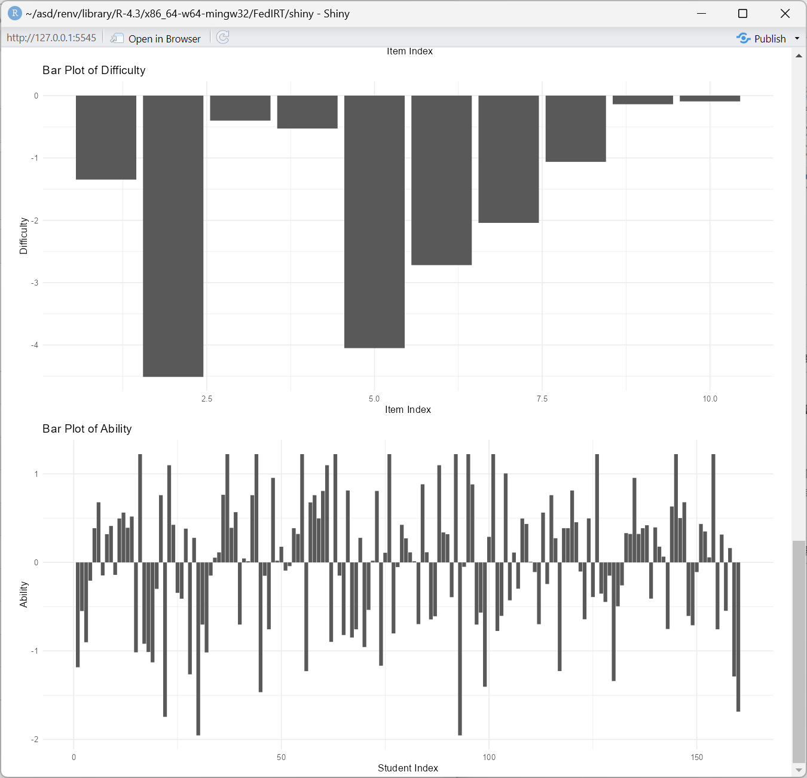

---
title: '``FedIRT``: An R package and shiny app for estimating federated item response theory models'
authors:
- name: Biying Zhou
  orcid: 0000-0002-3590-3408
  affiliation: 1
- name: Feng Ji
  orcid: 0000-0002-2051-5453
  affiliation: 1
  corresponding: true
  email: f.ji@utoronto.ca
affiliations:
- name: Department of Applied Psychology & Human Development, University of Toronto, Toronto, Canada
  index: 1
date: "\\today"
output: pdf_document
bibliography: paper.bib
tags:
- R
- shiny app
- Federated Learning
- Item Response Theory
- Maximum Likelihood Estimation
<!-- header-includes:
  \usepackage{bm} -->
---

# Summary

We developed an `R` package `FedIRT`, to estimate traditional IRT models, including 2PL and the graded response models with additional privacy, allowing parameter estimation in a distributed manner without compromising estimation accuracy. Numerical experiments demonstrate that Federated IRT estimation achieves comparable statistical performance to mainstream IRT packages in R, with the benefits of privacy preservation and minimal communication costs. The R package also includes a user-friendly Shiny app that allows clients (e.g., individual schools) and servers (e.g., school boards) to apply our proposed method in a user-friendly manner. 

# Statement of Need

IRT [@embretson2013item] is a statistical modeling framework grounded in modern test theory, frequently used in the educational, social, and behavioral sciences to measure latent constructs through multivariate human responses. Traditional IRT estimation mandates the centralization of all individual raw response data in one location, thereby potentially compromising the privacy of the data and participants [@lemons2014predictive]. 

Federated learning has emerged as a field addressing data privacy issues and techniques for parameter estimation in a decentralized, distributed manner. However, there is currently no package available in psychometrics, especially in the context of IRT, that integrates federated learning with IRT model estimation.

Mainstream IRT packages in `R`, such as `mirt` [@chalmers2012mirt] and `ltm` [@rizopoulos2007ltm] require storing and computing all data in a single location, which can potentially lead to violations of privacy policies when dealing with highly sensitive data (e.g., high-stakes student assessments).

We have therefore developed a specialized R package, `FedIRT`, to integrate federated learning with IRT. We have also developed an accompanying Shiny app to recognize real-world challenges and aim to reduce the burden of learning R programming for applying this package. This app implements the method in a user-friendly and accessible manner.

# Method

Here we briefly introduce the key idea behind integrating federated learning with IRT. For details, please refer to our methodological discussions on Federated IRT [@FedIRT2023; @FederatedIRT2024_1; @FedIRT2024].

## Model formulation

The two-parameter logistic (2PL) IRT model is often considered the most popular IRT model. In 2PL, the response by person $i$ for item $j$ is often binary: $X_{ij} \in \{0,1\}$, and the probability of person $i$ answering item $j$ with discrimination $\alpha_j$ and difficulty $\beta_j$ correctly:

$$P(X_{ij} = 1|\theta_i) = \frac{e^{\alpha_{j}(\theta_i-\beta_{j})}}{1+e^{\alpha_{j}(\theta_i-\beta_{j})}}$$

To make our package available for polytomous response, we also developed a federated learning estimation algorithm for the Generalized Partial Credit Model (GPCM) in which the probability of a person with the ability $\theta_i$ obtaining $x$ scores in item $j$ is: 

$$P^{\text{GPCM}}(X_{ij} = x|\theta_i) = \frac{e^{\sum \limits_{h=1}^{x} \alpha_{j}(\theta_i-\beta_{jh})}}{\sum \limits_{c=0}^{m_j}e^{\sum \limits_{h=1}^{c} \alpha_{j}(\theta_i-\beta_{jh})}}$$

In this function, $\beta_{jh}$ is the difficulty of scoring level $h$ for item $j$, and for each item $j$, all difficulty levels have the same discrimination $\alpha_j$. $m_j$ is the maximum score of item $j$. 

## Model estimation

In both 2PL and GPCM, often we assume the ability follows a standard normal distribution, thus we can apply MMLE.

We use a combination of traditional MMLE with federated average (FedAvg) and federated stochastic gradient descent (FedSGD) [@mcmahan2017communication]. In our case, the log-likelihood and partial gradients are sent from the clients to the server. Then, the server uses FedSGD to update the item parameters and send them back to clients. By iterations, the model converges and displays the estimates on the interface. 

Taking the 2PL model as an example, which has a marginal log-likelihood function $l$ for each school $k$ that can be approximated using Gaussian-Hermite quadrature with $q$ (by default, $q = 21$) equally-spaced levels, and let $V(n)$ to be the ability value of level $n$, and $A(n)$ is the weight of level $n$.

$$ l_k \approx \sum \limits_{i=1}^{N_k} \sum \limits_{j=1}^{J} {X_{ijk}} \times \log [\sum\limits_{n=1}^{q} P_j ( V(n) ) A(n)] + (1-X_{ijk}) \times \log [\sum\limits_{n=1}^{q} Q_j ( V(n) ) A(n)] $$

By applying FedAvg, the server collects the log-likelihood values from all $k$ schools and then sums up all the likelihood values to get the overall log-likelihood value: $l = \sum\limits_{k=1}^{K} l_k$.

The server collects a log-likelihood value $l_k$ and all derivatives $\frac{ l_k }{\partial \alpha_j}$ and $\frac{ l_k }{\partial \beta_j }$ from all clients, then observe that $\frac{\partial l}{\partial \alpha_j} = \sum\limits_{k=1}^{K}\frac{ l_k }{ \partial \alpha_j }$ and $\frac{\partial l}{\partial \beta_j} = \sum\limits_{k=1}^{K}\frac{l_k }{\partial \beta_j }$ by FedSGD, the server sum up all log-likelihood values and derivative values. 

Also, we implemented a Federated Median method, which uses the median of the likelihood values to replace the sum of likelihood values in Fed-MLE. It is more robust when there are outliers in input data. 

With estimates of $\alpha_j$ and $\beta_j$ in 2PL or $\beta_{jh}$ in GPCM, empirical Bayesian estimates of students' ability can be obtained [@bock1981marginal]. 

# Comparison with existing packages

We showcase that our package could generate the same result as traditional IRT packages, for example, `mirt` [@chalmers2012mirt]. Take 2PL as an example, we use a synthesized dataset with 160 students and 10 items. %For traditional packages, the whole dataset is used. For our package, the dataset was separated into two parts, which contain 81 and 79 students. 

\autoref{acomparison} and \autoref{bcomparison} show the comparison of the discrimination and difficulty parameters between `mirt` and `FedIRT` based on `example_data_2PL` in our package.


# Availability

The R package ``FedIRT`` is publicly available on [Github](https://github.com/Feng-Ji-Lab/FedIRT). It could be installed and run by using the following commands:

``` r
devtools::install_github("Feng-Ji-Lab/FedIRT")
library(FedIRT)
```

To provide wider access for practitioners, we include the Shiny user interface in our package. A detailed manual was provided in the package. Taking the 2PL as an example, we illustrate how to use the Shiny app below.

In the first step, the server end (e.g., test administer, school board) can be launched by running the Shiny app (`runserver()`) with the interface shown below:


Then, the client-end Shiny app can be initialized (`runclient()`). 

When the client first launches, it will automatically connect to the localhost port `8000` as default. 

If the server is deployed on another computer, type the server's IP address and port (which will be displayed on the server's interface), then click "reconnect". The screenshots of the user interface are shown below. 


Then, the client should choose a file to upload to the local Shiny app to do local calculations, without sending it to the server. The file should be a \texttt{.csv} file, with either binary or graded response, and all clients should share the same number of items, and the same maximum score in each item (if the answers are polytomous), otherwise, there will be an error message suggesting to check the datasets of all clients.


After all the clients upload their data, the server should click "start" to begin the federated estimates process and after the model converges, the client should click "receive result". The server will display all item parameters and the client will display all item parameters and individual ability estimates. 


The clients will also display bar plots of the ability estimates. 



# References
